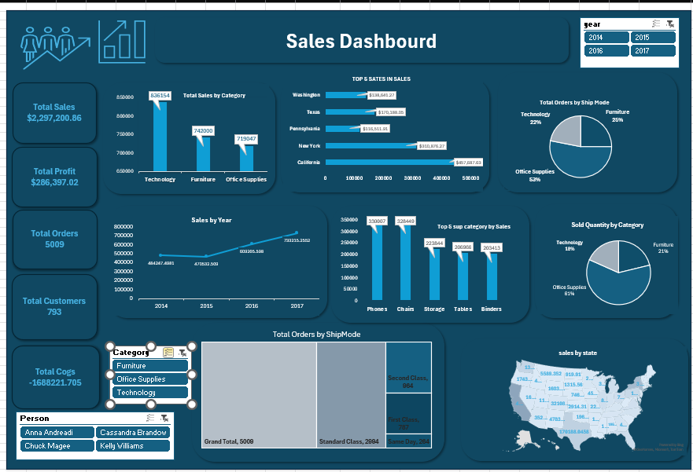

# 📊 Comprehensive Sales Dashboard  

## 👩‍🎓 Student Information
| Name | Training Program | Project Type | Tool Used |
|------|------------------|--------------|------------|
| Mona Eltopagy | NTI Data Analysis Training | First Week Project | Microsoft Excel |

---

## 📌 Project Overview
This project presents a **Comprehensive Sales Dashboard** designed during the **NTI Data Analysis Training**.  
The dashboard provides **interactive visualizations** and **key insights** into sales performance, profitability, customer behavior, and regional trends, enabling stakeholders to make **data-driven decisions**.

---

## 📊 Key Metrics
| Metric              | Value           |
|---------------------|------------------|
| **Total Sales**     | $2,297,200.86    |
| **Total Profit**    | $286,397.02      |
| **Total Orders**    | 5,009            |
| **Total Customers** | 793              |
| **Top Categories**  | Technology • Furniture • Office Supplies |
| **Top States**      | Washington • Pennsylvania • California |
| **Top Reps**        | Anna Andresi • Chuck Magee • Cassandra Brandon • Kelly Williams |

---

## 🔍 Key Insights

- **Top Categories & Products**  
  - Technology leads overall sales, followed by Office Supplies and Furniture.  
  - Phones, Chairs, and Binders are the **top-selling products**.

- **Regional Performance**  
  - **Washington** and **California** generate the **highest revenue**.  
  - Underperforming states represent **opportunities for market expansion**.

- **Yearly Trends**  
  - Sales showed **steady growth** from **2014 to 2017** with seasonal peaks.  
  - This analysis helps improve **inventory and marketing strategies**.

- **Profitability Analysis**  
  - Technology contributes the **highest share of total profit**, highlighting strong ROI.

- **Sales Representative Performance**  
  - **Anna Andresi** and **Cassandra Brandon** are the **top-performing reps**.

---

## 🛠️ Tools & Techniques

- **Microsoft Excel** → Dashboard development  
- **Data Cleaning & Preparation** → Ensured data accuracy and consistency  
- **Pivot Tables & Pivot Charts** → Used for KPIs and performance analysis  
- **Slicers & Filters** → Enabled dynamic exploration of data  
- **Data Visualization** → Designed a **clear, intuitive, and interactive dashboard**

---

## 🚀 Project Outcome

This dashboard delivers a **360° view** of sales performance and business trends:  
- Tracks **sales growth** and **profitability**  
- Highlights **top-performing products, reps, and regions**  
- Identifies **areas for improvement and new opportunities**  
- Enables **data-driven decision-making**

---

## 📷 Dashboard Preview

---

